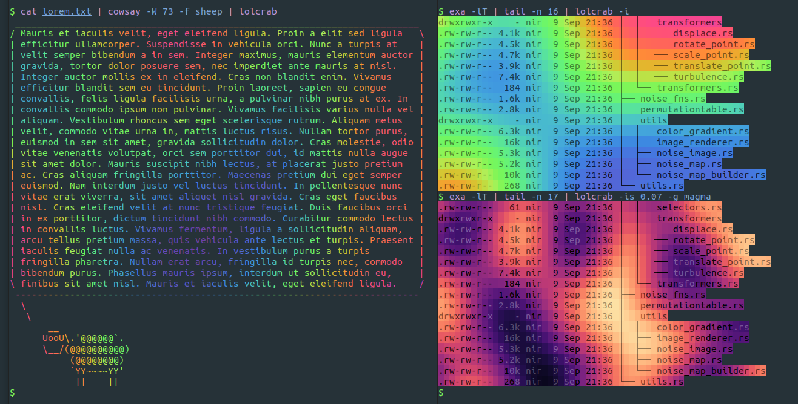

# `lolcrab` :crab:

> make your life more colorful, still boring but more colorful

[](https://github.com/mazznoer/lolcrab/actions)
[](https://crates.io/crates/lolcrab)
[](https://docs.rs/lolcrab)

Like [`lolcat`](https://github.com/busyloop/lolcat) but with [noise](https://en.wikipedia.org/wiki/OpenSimplex_noise) and more colorful. This is a fork of [`lcat`](https://github.com/davidkna/lcat-rs).



## Installation

Pre-compiled binaries for Linux, macOS and Windows is avaliable on [release page](https://github.com/mazznoer/lolcrab/releases).

### Cargo

`lolcrab` can be installed using [cargo](https://www.rust-lang.org/tools/install).

```shell
cargo install lolcrab
```

## Usage

```text
Usage: lolcrab [OPTIONS] [File]...

Arguments:
  [File]...  Files to read [default: -]

Options:
  -g, --gradient <NAME>        Sets color gradient [default: rainbow] [possible values: cividis, cool, cubehelix,
                               fruits, inferno, magma, plasma, rainbow, rd-yl-gn, sinebow, spectral, turbo,
                               viridis, warm]
      --presets                Show all preset gradients
  -c, --custom <CSS Gradient>  Custom gradient in CSS gradient format
      --sharp <NUM>            Sharp gradient
  -s, --scale <FLOAT>          Sets noise scale. Try value between 0.01 .. 0.2 [default: 0.034]
  -S, --seed <NUM>             Sets seed [default: random]
  -i, --invert                 Colorize the background
  -r, --random-colors <NUM>    Use random colors as custom gradient [1 .. 100]
  -a, --animate                Enable animation mode
  -d, --duration <NUM>         Animation duration
      --speed <SPEED>          Animation speed
  -h, --help                   Print help
  -V, --version                Print version
```

## Using `lolcrab` as a Library

Add this to your Cargo.toml

```toml
lolcrab = { version = "0.4", default-features = "false" }
```

### Example

```rust
use lolcrab::Lolcrab;
use std::io;

const TEXT: &str = "\
•••••••••••••••••••••••••••••••••••••••••••
••442463299144744830108724702438783348716••
••665891426009540978622724448305819269356••
••078289454141226451790882961903610719673••
••56505384476•••••••••••••••••39761609699••
••47928752907•• { lolcrab } ••33810561851••
••51609982385•••••••••••••••••43459368213••
••980457234663167653959566555465520046709••
••677103598707232478714861999441705454744••
••012721882924436718718457599087686681354••
•••••••••••••••••••••••••••••••••••••••••••
";

fn main() -> Result<(), Box<dyn std::error::Error>> {
    let stdout = io::stdout();
    let mut stdout = stdout.lock();

    // Initialize Lolcrab using default gradient and default noise
    let mut lol = Lolcrab::new(None, None);

    lol.colorize_str(TEXT, &mut stdout)?;

    lol.set_invert(true);
    lol.randomize_position();
    lol.colorize_str(TEXT, &mut stdout)?;

    lol.set_invert(false);
    lol.reset_position();
    lol.colorize_str(TEXT, &mut stdout)?;

    Ok(())
}
```
